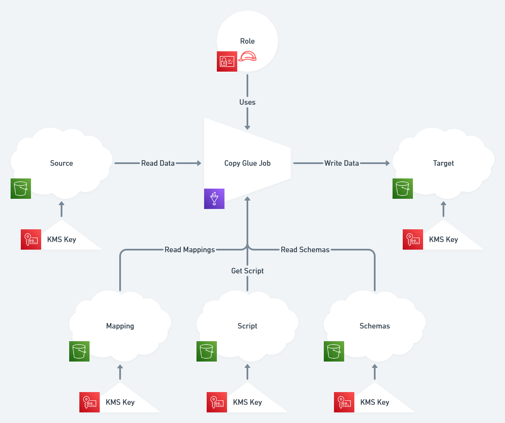

# Modules > Glue > Copy #

Template for a Glue Job that copies structured data from one S3 Bucket to
another S3 Bucket.

# The Mappings #

Mappings are JSON file that describe how the data is copied from one bucket to the other.